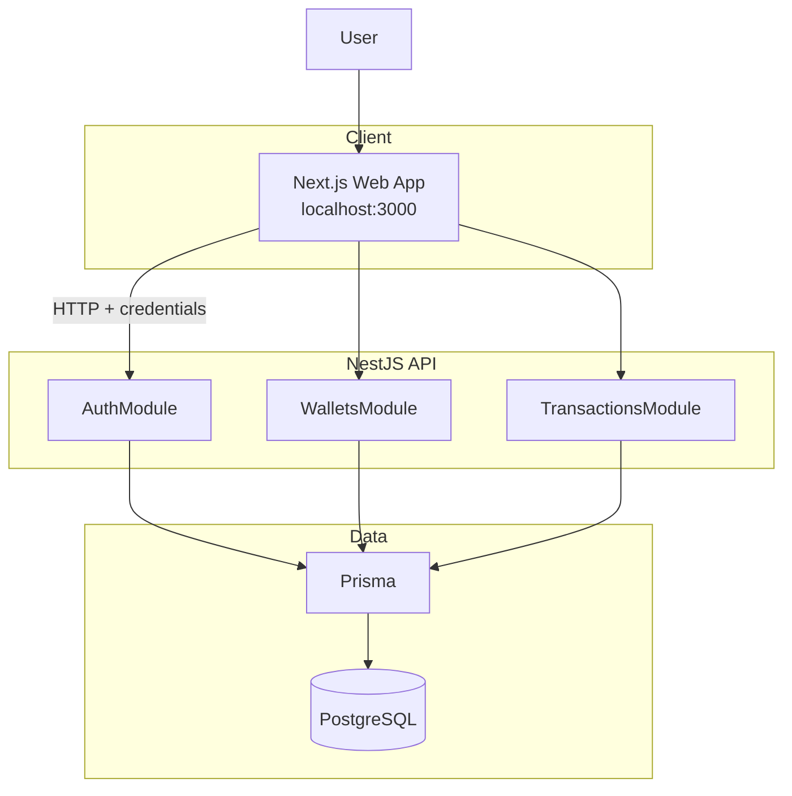
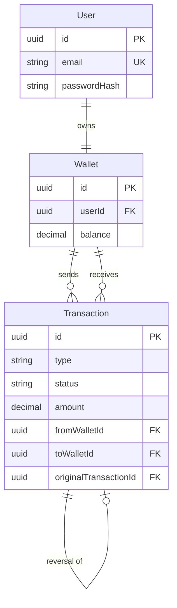
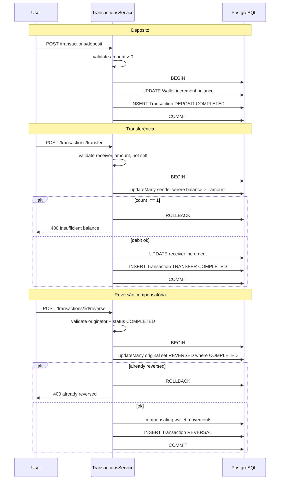

# Arquitetura da solução

Documentação técnica consolidada do **financial-wallet-challenge**.

**Ver também:** [README](../README.md) · [Testes manuais](manual-tests.md) · [Requisitos](requirements.md)

## Visão geral

Monólito modular full-stack: **Next.js** no frontend, **NestJS** na API, **PostgreSQL** via Docker, **Prisma** como ORM, autenticação **JWT em cookie HttpOnly** e **Material UI** para a interface.

A API concentra regras financeiras; o frontend consome contratos HTTP com `credentials: "include"`.

## Arquitetura geral

## Modelagem de dados

- **User 1:1 Wallet** — uma carteira por usuário (`userId` único).
- **Transaction** liga carteiras de origem e destino (`fromWalletId` / `toWalletId` opcionais conforme o tipo).
- **Auto-relacionamento em `Transaction`** — a reversão (`type = REVERSAL`) aponta para a operação original via `originalTransactionId` (FK para outro registro da mesma tabela). Relação **1:0..1**: cada original tem no máximo uma reversão (`@unique`).

Tipos: `DEPOSIT`, `TRANSFER`, `REVERSAL`. Status da original: `COMPLETED` → `REVERSED`.

## Fluxo financeiro principal

**Regras resumidas:**

- **Depósito** — credita wallet autenticada; aceita saldo negativo prévio.
- **Transferência** — débito condicional atômico; crédito e registro na mesma transação de banco.
- **Reversão** — apenas originador (depositante ou remetente); saldo negativo após reversão é aceitável.

## Decisões principais

| Decisão | Motivo |
|---------|--------|
| Monólito modular | Simplicidade operacional; módulos NestJS com responsabilidades claras |
| `Decimal` para dinheiro | Evita erros de arredondamento de ponto flutuante |
| Transações Prisma (`$transaction`) | Atomicidade entre saldo e registro de `Transaction` |
| `updateMany` condicional | Protege transferência e reversão contra concorrência |
| Reversão compensatória | Preserva auditabilidade sem apagar histórico |
| Cookie HttpOnly | JWT inacessível ao JavaScript do browser |
| Material UI | Produtividade e consistência visual no frontend |

**Frontend:** componentes `.tsx` para renderização, hooks `use-*.ts` para estado/fluxo, `.styles.ts` para `SxProps` quando necessário, `services/` para HTTP.

**Fora de escopo:** microservices, filas, Redis, CQRS, event sourcing.
