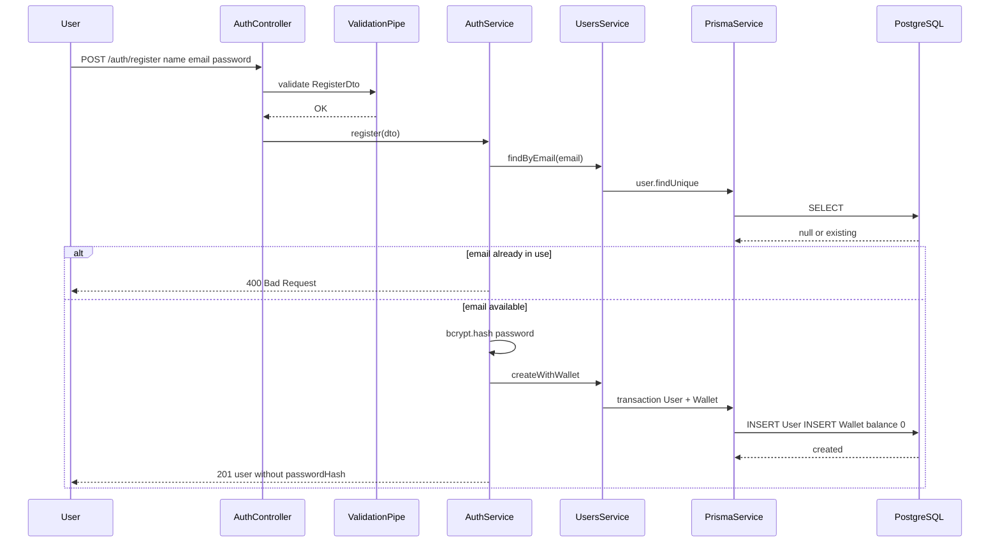
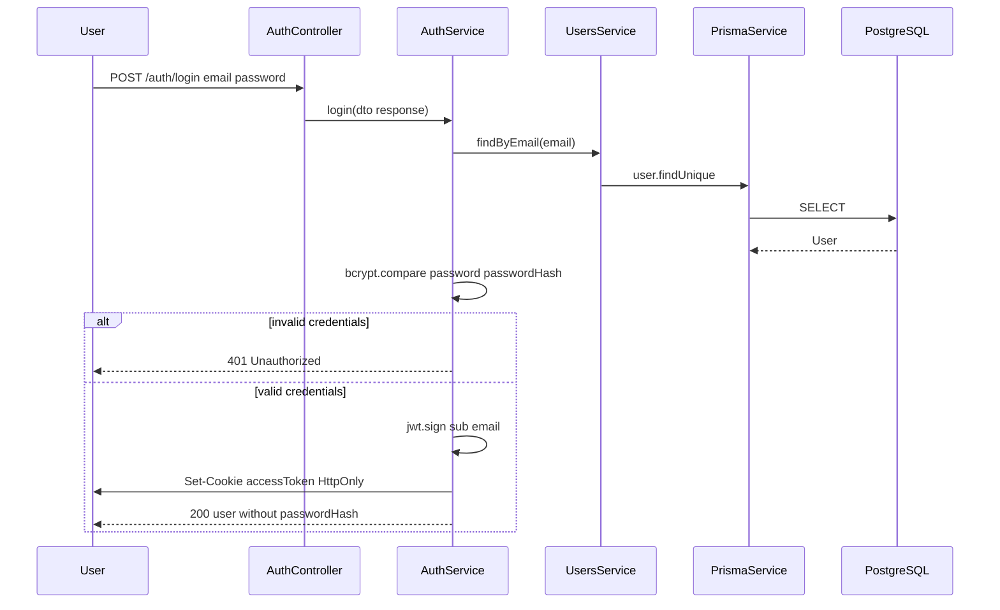
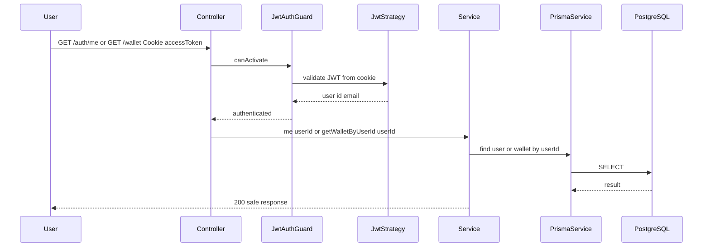
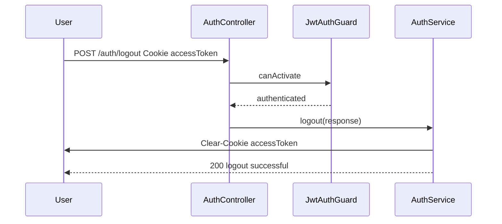

# Fluxo de autenticação

Fluxos **implementados** na etapa atual: cadastro, login, logout, `/auth/me` e `GET /wallet`.

Autenticação via **JWT em cookie HttpOnly** — o token não é exposto ao JavaScript do browser (diferente de `localStorage`).

## Cadastro (`POST /auth/register`)

**Regras:**

- Email único.
- Senha com hash bcrypt (cost factor 10).
- Wallet criada automaticamente com `balance = 0`.
- Resposta nunca inclui `passwordHash`.

## Login (`POST /auth/login`)

**Cookie:**

- Nome: `accessToken`
- Flags: `httpOnly`, `sameSite: lax`, `secure` em produção
- Expiração: 1 dia

## Rotas protegidas (`GET /auth/me`, `GET /wallet`)

**Isolamento:**

- `GET /wallet` usa apenas o `userId` extraído do JWT.
- Não há parâmetro de wallet ID vindo do client — impossível consultar wallet de outro usuário.

## Logout (`POST /auth/logout`)

**Stateless:** não há blacklist de token no servidor. O cookie é removido; o JWT expira naturalmente se ainda existir em cache do client.

## Resumo de segurança

| Aspecto | Implementação |
|---------|---------------|
| Armazenamento de senha | bcrypt hash |
| Sessão | JWT em cookie HttpOnly |
| Proteção de rotas | `JwtAuthGuard` |
| Exposição de dados | `passwordHash` nunca retornado |
| CORS | `credentials: true` para cookies cross-origin controlados |
