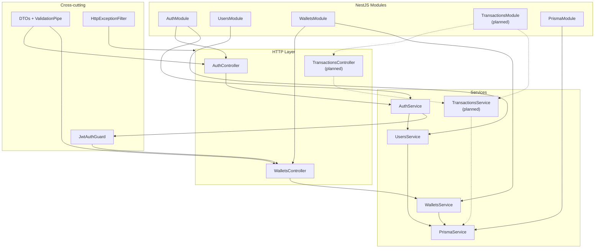

# Arquitetura do backend

Organização atual da API NestJS em `api/`.

## Princípios

- **Monólito modular** — um processo, módulos com responsabilidades claras.
- **Controllers finos** — recebem HTTP, delegam para services, não contêm regra de negócio.
- **Services concentram regras** — validações de domínio, orquestração e persistência.
- **PrismaService isola o banco** — único ponto de acesso via Prisma Client com adapter `@prisma/adapter-pg` (Prisma 7).
- **Filtros padronizam erros** — respostas consistentes para o cliente.
- **Evitado por escopo** — microservices, filas (RabbitMQ/Kafka), Redis, CQRS, event sourcing.

## Diagrama de módulos e camadas



## Módulos implementados

| Módulo | Responsabilidade |
|--------|------------------|
| **AuthModule** | Registro, login, logout, `/auth/me`; emissão e validação JWT |
| **UsersModule** | CRUD interno de usuários; criação atômica User + Wallet no cadastro |
| **WalletsModule** | Consulta de saldo da wallet autenticada |
| **PrismaModule** | Provider global do `PrismaService` |

## Módulo planejado

| Módulo | Responsabilidade |
|--------|------------------|
| **TransactionsModule** | Depósito, transferência, reversão e histórico — *próxima etapa* |

## Endpoints expostos (etapa atual)

| Método | Rota | Guard | Descrição |
|--------|------|-------|-----------|
| `POST` | `/auth/register` | — | Cadastro + wallet com saldo 0 |
| `POST` | `/auth/login` | — | Login; define cookie HttpOnly |
| `POST` | `/auth/logout` | JWT | Limpa cookie (stateless) |
| `GET` | `/auth/me` | JWT | Dados do usuário autenticado |
| `GET` | `/wallet` | JWT | Saldo da wallet do usuário logado |

## Tratamento de erros

O `HttpExceptionFilter` global converte exceções em respostas JSON padronizadas:

```json
{
  "statusCode": 400,
  "message": "Email already in use",
  "error": "Bad Request",
  "path": "/auth/register",
  "timestamp": "2026-07-03T20:00:00.000Z"
}
```

## Prisma 7 e adapter PostgreSQL

O Prisma 7 remove o query engine embutido e exige um **driver adapter** em runtime. O `PrismaService` instancia:

- `pg.Pool` com `DATABASE_URL`
- `@prisma/adapter-pg` (`PrismaPg`) passado ao `PrismaClient`

Comandos CLI (`migrate`, `generate`) usam `prisma.config.ts`; a conexão da aplicação é configurada no adapter.

## Estrutura de pastas (referência)

```text
api/src/
├── auth/           # Controller, Service, DTOs, Guard, Strategy
├── users/          # UsersService
├── wallets/        # Controller, Service
├── prisma/         # PrismaModule, PrismaService
└── common/
    └── filters/    # HttpExceptionFilter
```
