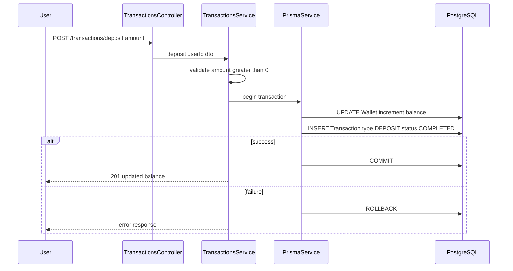
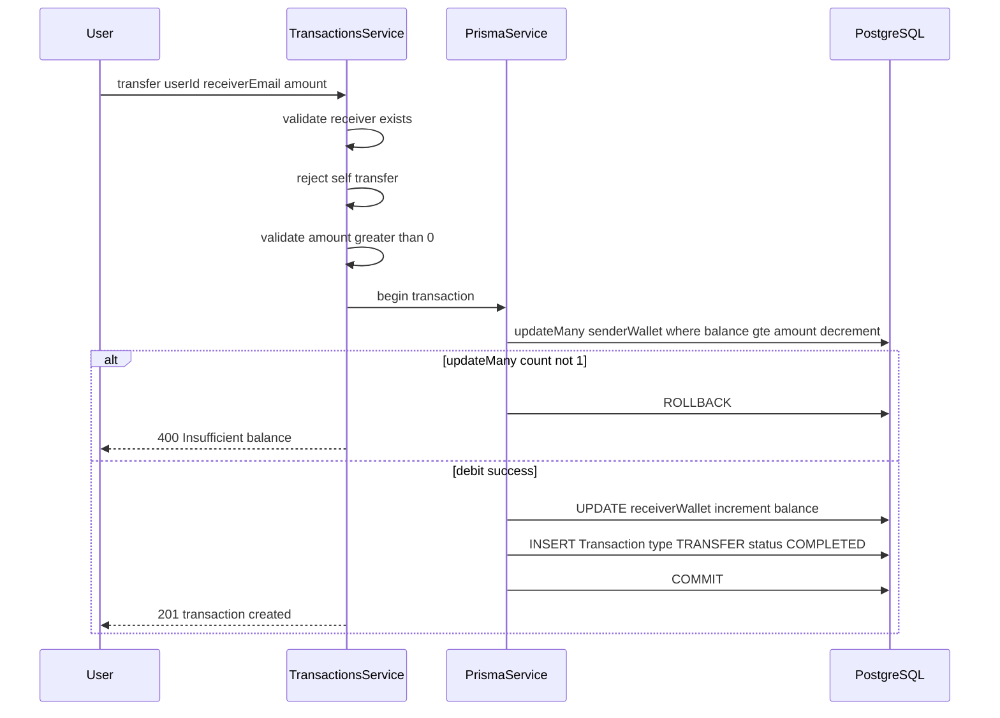
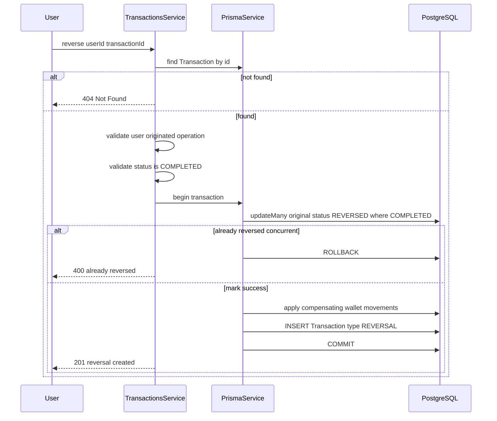
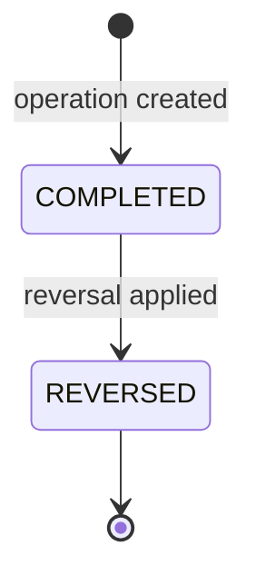

# Operações financeiras

> **Status: planejado — não implementado nesta etapa.**
>
> Este documento descreve a arquitetura prevista para o `TransactionsModule`. Depósito, transferência, reversão e histórico **ainda não possuem endpoints nem service** no código atual. Os diagramas servem como guia para a próxima implementação.

## Visão geral

O `TransactionsService` (planejado) concentrará:

- validação de valores e permissões;
- operações atômicas via `Prisma.$transaction`;
- proteção contra concorrência na transferência;
- reversão compensatória com restrição ao usuário originador.

Endpoints planejados:

| Método | Rota | Descrição |
|--------|------|-----------|
| `GET` | `/transactions` | Histórico da wallet autenticada |
| `POST` | `/transactions/deposit` | Depósito |
| `POST` | `/transactions/transfer` | Transferência |
| `POST` | `/transactions/:id/reverse` | Reversão |

---

## a) Depósito (planejado)



**Regras:**

- Usuário autenticado.
- `amount > 0`.
- Soma ao saldo atual (mesmo se negativo: ex. `-50 + 100 = 50`).
- Operação atômica (update + insert na mesma transação de banco).

---

## b) Transferência (planejado)



**Proteção contra concorrência:**

O débito usa `updateMany` condicional — só debita se `balance >= amount` no momento exato do update:

```typescript
const updatedSenderWallet = await tx.wallet.updateMany({
  where: {
    id: senderWallet.id,
    balance: { gte: amount },
  },
  data: {
    balance: { decrement: amount },
  },
});

if (updatedSenderWallet.count !== 1) {
  throw new BadRequestException('Insufficient balance');
}
```

**Garantias:**

- Atomicidade — débito, crédito e registro na mesma transação.
- Rollback total se qualquer etapa falhar.
- Duas transferências concorrentes não podem gastar o mesmo saldo.

---

## c) Reversão (planejado)



**Regra de autorização (reversão manual):**

| Tipo original | Quem pode reverter |
|---------------|-------------------|
| `DEPOSIT` | Dono da wallet que recebeu o depósito |
| `TRANSFER` | Remetente original (destinatário **não** pode reverter) |

**Princípios:**

- Não apaga histórico — transação original permanece, marcada como `REVERSED`.
- Cria transação compensatória (`type = REVERSAL`) vinculada via `originalTransactionId`.
- Saldo negativo após reversão é **aceitável** (ex.: destinatário já gastou o valor).
- Reversões administrativas por inconsistência seriam **melhoria futura** com auditoria e autorização próprias.

---

## Diagrama de status da transação



## Tipos vs. status

| Conceito | Valores | Descrição |
|----------|---------|-----------|
| **Tipo** (`TransactionType`) | `DEPOSIT`, `TRANSFER`, `REVERSAL` | Natureza da operação |
| **Status** (`TransactionStatus`) | `COMPLETED`, `REVERSED` | Estado da transação original |

**Ciclo de vida:**

1. Transação original criada com `status = COMPLETED`.
2. Ao reverter, a original passa para `status = REVERSED` e recebe `reversedAt`.
3. Nova transação `type = REVERSAL` é criada para compensar a operação original.

A transação `REVERSAL` em si permanece `COMPLETED` — ela não é "revertida" novamente.
