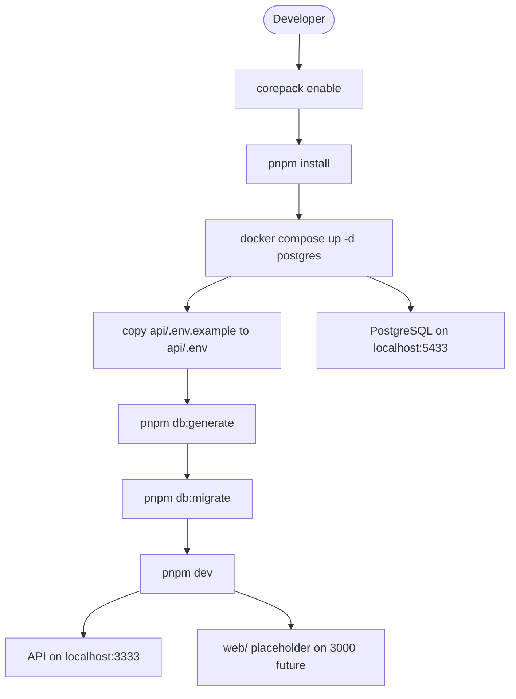

# Fluxo de execução local

Passo a passo para subir o ambiente de desenvolvimento do **financial-wallet-challenge**.

## Diagrama do fluxo



## Comandos

```bash
corepack enable
pnpm install
docker compose up -d postgres
cp api/.env.example api/.env        # Windows: Copy-Item api/.env.example api/.env
pnpm db:generate
pnpm db:migrate
pnpm dev
```

Para subir apenas a API:

```bash
pnpm dev:api
```

## O que cada passo faz

| Passo | Ação |
|-------|------|
| `corepack enable` | Habilita pnpm via Node.js |
| `pnpm install` | Instala dependências do monorepo (único `node_modules` na raiz) |
| `docker compose up -d postgres` | Sobe PostgreSQL 16 em container |
| Copiar `.env` | Configura `DATABASE_URL`, `JWT_SECRET`, `PORT`, `FRONTEND_URL` |
| `pnpm db:generate` | Gera Prisma Client a partir do schema |
| `pnpm db:migrate` | Aplica migrations existentes (`prisma migrate deploy`, sem prompt) |
| `pnpm db:migrate:dev` | Cria nova migration em desenvolvimento (`prisma migrate dev`) |
| `pnpm dev` | Sobe API (`pnpm dev:api`) e placeholder web via `concurrently` |

## Portas padrão

| Serviço | Porta | Observação |
|---------|-------|------------|
| NestJS API | `3333` | Configurável via `PORT` |
| PostgreSQL (Docker) | `5433` | Mapeado para `5432` no container — evita conflito com PG local |
| PostgreSQL (local Windows) | `5432` | Fallback sem Docker — ver [setup-local-postgres.md](../setup-local-postgres.md) |
| Next.js Web | `3000` | *Planejado* — `web/` ainda é placeholder |

## Pré-requisitos

- Node.js 20+
- pnpm 10+ (via Corepack)
- Docker Desktop em execução

## Problemas conhecidos

### Docker: Virtualization support not detected

O Docker Desktop não inicia quando a virtualização de hardware está desabilitada no BIOS/UEFI.

**Opções:**

1. Habilitar VT-x (Intel) ou AMD-V/SVM no BIOS e reiniciar o Docker Desktop.
2. Usar **PostgreSQL local** (sem Docker) — guia completo: [setup-local-postgres.md](../setup-local-postgres.md).

Neste ambiente foi detectado PostgreSQL 18 nativo (`postgresql-x64-18` em execução). Basta criar `wallet_db` e `wallet_user` com o script `api/scripts/setup-local-db.sql`.

### Docker Desktop não está rodando (daemon offline)

Durante o setup inicial, `docker compose up -d postgres` falhou com:

```text
failed to connect to the docker API at npipe:////./pipe/dockerDesktopLinuxEngine
```

**Solução:** iniciar o Docker Desktop e executar novamente:

```bash
docker compose up -d postgres
```

### `pnpm db:migrate` falha

A migration depende do PostgreSQL estar ativo e acessível com as credenciais de `api/.env`.

Verificar:

1. Container rodando e healthy: `docker compose ps`
2. `DATABASE_URL` em `api/.env` apontando para `localhost:5433`
3. Credenciais: `wallet_user` / `wallet_password` / `wallet_db`

**Criar nova migration (desenvolvimento):** use `pnpm db:migrate:dev` — este comando é interativo e pede nome da migration.

**Advisory lock timeout:** reinicie o container (`docker compose restart postgres`) e tente novamente.

### Scripts úteis adicionais

```bash
pnpm db:studio    # Prisma Studio — interface visual do banco
pnpm build        # Compila a API
pnpm lint         # ESLint na API
pnpm test         # Testes (serão adicionados na etapa de transações)
```

## Estrutura após setup

```text
financial-wallet-challenge/
├── node_modules/       # dependências compartilhadas (pnpm)
├── api/                # NestJS rodando em dev
├── web/                # placeholder (sem Next.js ainda)
├── docker-compose.yml  # PostgreSQL container
└── api/.env            # variáveis locais (não versionado)
```
