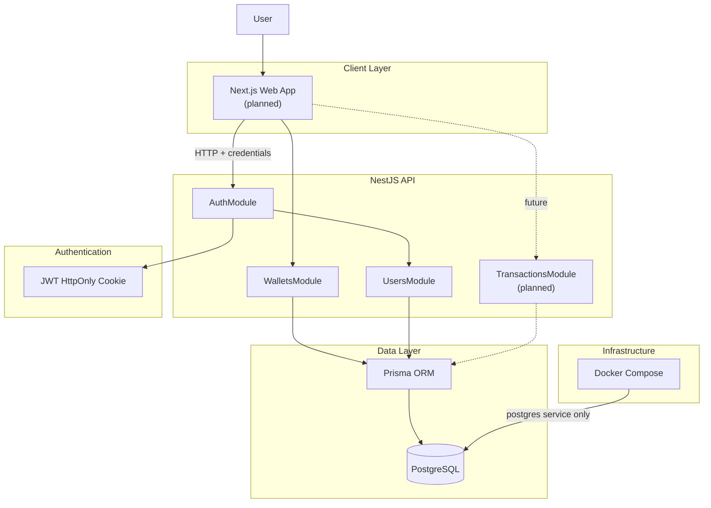

# Visão geral do sistema

Este documento descreve a arquitetura de alto nível do **financial-wallet-challenge**.

## Contexto

O projeto é um monólito modular full-stack: uma API NestJS e, em etapa futura, uma aplicação Next.js. O banco PostgreSQL roda em Docker; API e web rodam localmente via pnpm.

**Etapa atual:** backend com autenticação e consulta de wallet. O pacote `web/` existe apenas como placeholder no workspace — o frontend Next.js ainda não foi implementado.

## Diagrama de componentes

Legenda:

- Linha sólida: implementado ou em uso hoje.
- Linha tracejada (`-.->`): planejado para etapa futura.

## Responsabilidades por camada

| Camada | Responsabilidade |
|--------|------------------|
| **Next.js Web App** | Interface do usuário (login, dashboard, formulários) — *planejado* |
| **NestJS API** | Regras de negócio, validação, autenticação, exposição HTTP |
| **JWT HttpOnly Cookie** | Sessão stateless sem expor token ao JavaScript do browser |
| **Prisma ORM** | Acesso tipado ao banco, migrations e transações |
| **PostgreSQL** | Persistência relacional com suporte ACID |
| **Docker Compose** | Apenas PostgreSQL; API e web não são containerizadas nesta etapa |

## Decisões de escopo

- **Monólito modular** — um deploy lógico, módulos bem separados internamente.
- **Sem microservices** — complexidade operacional desnecessária para o desafio.
- **Sem Redis, filas, CQRS ou event sourcing** — não há requisito que justifique essa infraestrutura.
- **Backend-first** — regras financeiras estabilizadas na API antes do frontend.

## Próximos documentos

- Detalhamento do backend: [backend-architecture.md](./backend-architecture.md)
- Modelo de dados: [database-model.md](./database-model.md)
- Fluxos financeiros planejados: [financial-operations.md](./financial-operations.md)
